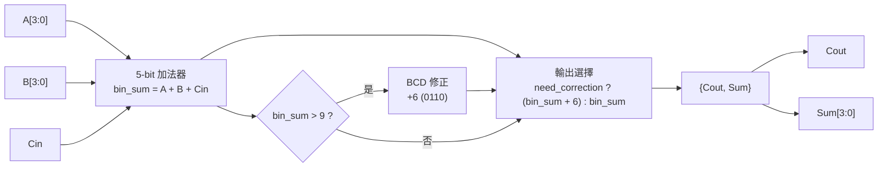

# BCD_add 專案說明

## 1. 專案目標

本專案使用 Verilog 實作「單位數 BCD 加法器（1-digit BCD Adder）」，可將兩個 BCD 位元組與一個輸入進位相加：

- 輸入：`A`、`B`（各 4-bit BCD）、`Cin`（進位輸入）
- 輸出：`Sum`（4-bit BCD 個位）、`Cout`（十位進位）

此設計為組合邏輯（Combinational Logic），不含時脈與暫存器。

## 2. 檔案架構

```text
BCD_add/
├─ BCD_add.v      # BCD 加法器主模組
├─ BCD_add.qpf    # Quartus 專案檔
├─ BCD_add.qsf    # Quartus 設定檔（含 Top-level 設定）
├─ BCD_add.qws    # Quartus 工作區檔
└─ db/            # Quartus 產生之資料庫
```

## 3. 模組介面

`BCD_add.v` 中的模組宣告如下：

```verilog
module BCD_add (
    input  [3:0] A,
    input  [3:0] B,
    input        Cin,
    output [3:0] Sum,
    output       Cout
);
```

### 3.1 I/O 說明

| 訊號 | 位寬 | 方向 | 說明 |
|---|---:|---|---|
| `A` | 4 | input | 第一個 BCD 數字（建議範圍 0000~1001） |
| `B` | 4 | input | 第二個 BCD 數字（建議範圍 0000~1001） |
| `Cin` | 1 | input | 低位傳入進位 |
| `Sum` | 4 | output | BCD 個位結果 |
| `Cout` | 1 | output | 十位進位輸出 |

## 4. 程式架構與資料流

模組內部使用兩個關鍵訊號：

1. `bin_sum`：先做一般二進位加法，範圍可到 19（十進位），因此使用 5-bit。
2. `need_correction`：判斷是否需要 BCD 修正。

對應程式：

```verilog
wire [4:0] bin_sum;
wire need_correction;

assign bin_sum = A + B + Cin;
assign need_correction = (bin_sum > 5'd9);
assign {Cout, Sum} = need_correction ? (bin_sum + 5'd6) : bin_sum;
```

### 4.1 BCD 加法器方塊圖



### 4.2 運作步驟

1. 先計算 `bin_sum = A + B + Cin`。
2. 若 `bin_sum <= 9`：代表結果已是合法 BCD 個位，直接輸出。
3. 若 `bin_sum > 9`：依 BCD 規則加上 6（`0110`）做十進位修正。
4. 修正後 5-bit 結果中：
   - 最高位輸出為 `Cout`。
   - 低 4 位輸出為 `Sum`。

## 5. 為什麼要「加 6」

BCD 單位位元只能表示 0~9（`0000`~`1001`）。
當二進位加法結果為 10~19 時（`1010`~`10011`），低 4-bit 不再是合法 BCD。
因此要加上 `0110`（十進位 6）把結果轉回合法 BCD 表示，並自然產生十位進位。

## 6. 範例

### 範例 1：7 + 2 + 0

- `A = 0111`（7）
- `B = 0010`（2）
- `Cin = 0`
- `bin_sum = 01001`（9）
- 不需修正，輸出：`Cout = 0`，`Sum = 1001`（9）

### 範例 2：8 + 5 + 0

- `A = 1000`（8）
- `B = 0101`（5）
- `Cin = 0`
- `bin_sum = 01101`（13）
- 需修正：`01101 + 00110 = 10011`
- 輸出：`Cout = 1`，`Sum = 0011`（3）
- 對應十進位結果為 13（十位 1、個位 3）

## 7. 設計特性

- 純組合邏輯，延遲主要來自比較器與加法器。
- 程式簡潔，容易擴充為多位數 BCD 加法器。
- 適合 CPLD/FPGA 基礎數位電路實作與教學。

## 8. 使用與整合建議

1. 本專案 `TOP_LEVEL_ENTITY` 已在 `BCD_add.qsf` 設為 `BCD_add`。
2. 若要做多位數 BCD 加法，可將低位 `Cout` 串接到高位 `Cin`。
3. 請盡量確保 `A`、`B` 來源是合法 BCD（0~9），以符合十進位語意。

## 9. 可再擴充的方向

- 新增 testbench 做完整模擬驗證。
- 增加輸入合法性檢查（偵測非 BCD 輸入）。
- 串接 2 位或 4 位 BCD 加法器，支援更大十進位數值運算。
